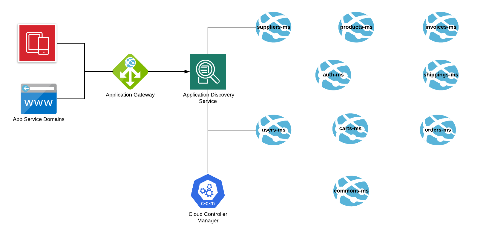

# Example of microservices application with Spring Boot, Zuul, Eureka, MySql, OAuth and RabbitMQ

Sample microservices application for an e-commerce:

- **Spring Boot:** Framework for creating standalone Java applications.
- **Jackson:** JSON parser for Java.
- **Netflix Zuul:** API gateway.
- **Netflix Eureka:** Service discovery.
- **RabbitMQ:** Message broker.

This application consists of four different services:

- **Product service:** Provides API for managing products. By default it runs on port `8001`.
- **Service discovery:** Netflix Eureka service that discovers and registers other service instances. By default it runs on port `8761`.
- **API gateway:** Netflix Zuul API gateway that sits on the top of the product and shopping list services, providing a gateway for those services. By default it runs on port `8765`.

See the diagram below:

<!-- Hack to center the image in GitHub -->

  

